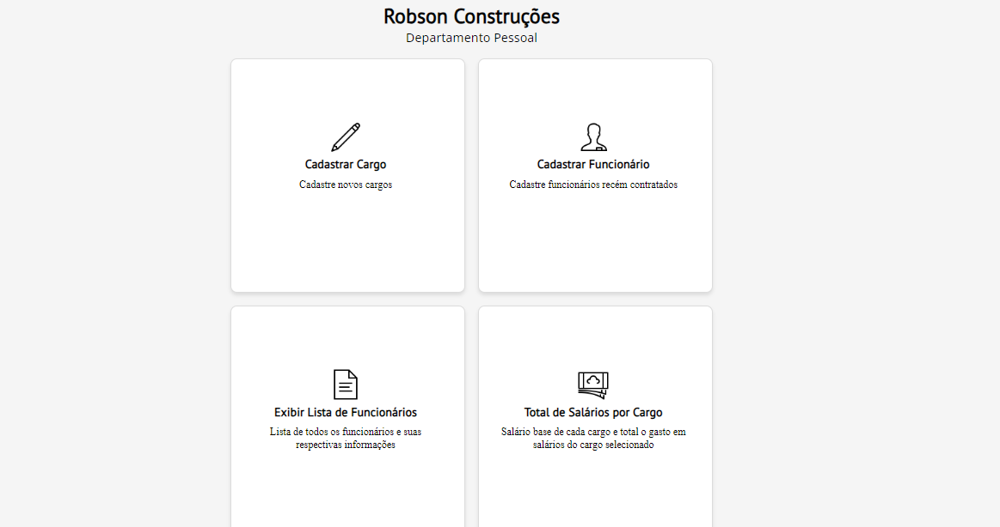
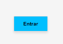
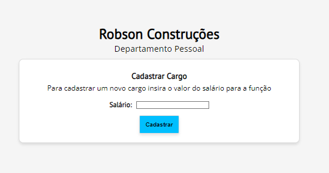
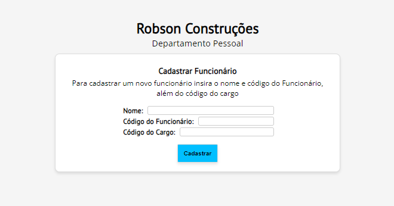
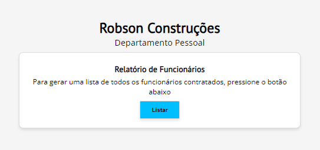
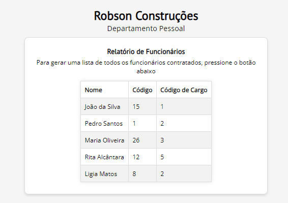
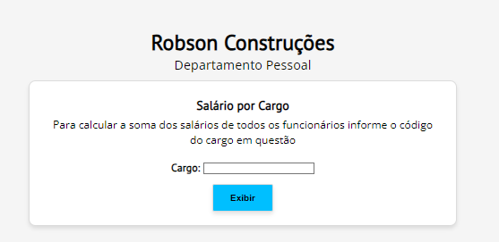

# Gerenciamento De Funcionários


<br>




> Aplicação de gerenciamento de funcionários

## ☕ Usando o Gerenciador de Funcionários

### [Vídeo de apresentação](youtu.be/l9wYtbTfcIY)

### Para usar Gerenciador de Funcionários, siga estas etapas:
```
1. Clique em "entrar".
```


### Para cadastrar um cargo:

```
1. Selecione a opção "Cadastrar Cargo".
2. Em seguida insira o valor do salário para a função.
3. Selecione "Cadastrar".
```

### Para cadastrar um cargo:


```
1. Selecione a opção "Cadastrar Funcionário".
2. Em seguida insira o nome, o código do funcionário e o código do cargo.
3. Selecione "Cadastrar".
```

### Para relatório de funcionários:

 
```
1. Selecione a opção "Exibir Lista de Funcionáios".
2. Em seguida selecione "Cadastrar".
```


### Para acessar salários por cargo:


```
1. Selecione a opção "Total de Salários por Cargo".
2. Em seguida insira o código do cargo em questão.
3. Selecione "Cadastrar".
```

## 📫 Contribuindo para Gerenciador de Funcionários

Para contribuir com Gerenciador de Funcionários, siga estas etapas:

1. Bifurque este repositório.
2. Crie um branch: `git checkout -b <nome_branch>`.
3. Faça suas alterações e confirme-as: `git commit -m '<mensagem_commit>'`
4. Envie para o branch original: `git push origin <nome_do_projeto> / <local>`
5. Crie a solicitação de pull.

Como alternativa, consulte a documentação do GitHub em [como criar uma solicitação pull](https://docs.github.com/pt/pull-requests/collaborating-with-pull-requests/proposing-changes-to-your-work-with-pull-requests/creating-a-pull-request).
